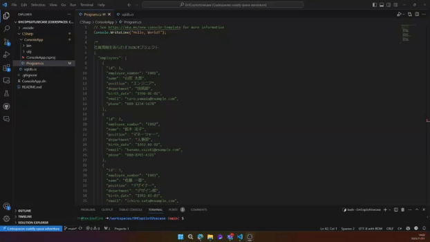

# GHCopilotUsecase
- [GHCopilotUsecase](#ghcopilotusecase)
  - [ユースケース：コメントの有効活用](#ユースケースコメントの有効活用)
    - [特定の JSON の情報を加味したコードを提案してほしい場合](#特定の-json-の情報を加味したコードを提案してほしい場合)
    - [SQLテーブルの情報を加味したコードを書いてほしい場合](#sqlテーブルの情報を加味したコードを書いてほしい場合)
## ユースケース：コメントの有効活用

### 特定の JSON の情報を加味したコードを提案してほしい場合

``` CSharp
/*
社員情報をあらわすJSONオブジェクト
{  
  "employees": [  
    {  
      "id": 1,  
      "employee_number": "E001",  
      "name": "山田 太郎",  
      "position": "エンジニア",  
      "department": "技術部",  
      "birth_date": "1990-01-01",  
      "email": "taro.yamada@example.com",  
      "phone": "080-1234-5678"  
    },  
    {  
      "id": 2,  
      "employee_number": "E002",  
      "name": "鈴木 花子",  
      "position": "マネージャー",  
      "department": "人事部",  
      "birth_date": "1992-02-02",  
      "email": "hanako.suzuki@example.com",  
      "phone": "080-8765-4321"  
    },  
    {  
      "id": 3,  
      "employee_number": "E003",  
      "name": "佐藤 一郎",  
      "position": "デザイナー",  
      "department": "デザイン部",  
      "birth_date": "1991-03-03",  
      "email": "ichiro.sato@example.com",  
      "phone": "080-5678-1234"  
    }  
  ]  
}  

*/
// 具体的にやってほしいことを書く
```



### SQLテーブルの情報を加味したコードを書いてほしい場合


``` CSharp
/*
ID	EmployeeNumber	Name	Position	Department	BirthDate	Email	Phone
1	E001	山田 太郎	エンジニア	技術部	1990-01-01	taro.yamada@example.com	080-1234-5678
2	E002	鈴木 花子	マネージャー	人事部	1992-02-02	hanako.suzuki@example.com	080-8765-4321
3	E003	佐藤 一郎	デザイナー	デザイン部	1991-03-03	ichiro.sato@example.com	080-5678-1234
*/
//このようなテーブルのSQL DBのテーブルを作るためのC#のコードを書いてください。
//ただし、EmployeeNumberは主キーで、IDは自動採番されるものとします。
//また、データベースの名前は「company」、テーブルの名前は「employee」とします。
//データベースの接続文字列は環境変数から取得するものとします。

//下記は、SQLテーブルの例を使って生成されたコードの例です。
using System;
using System.Data.SqlClient;

public class Program
{
    public static void Main()
    {
        // 接続文字列
        var connectionString = Environment.GetEnvironmentVariable("SQLAZURECONNSTR_company");
        using (var connection = new SqlConnection(connectionString))
        {
            connection.Open();
            // テーブル作成
            var command = connection.CreateCommand();
            command.CommandText = @"
                CREATE TABLE employee (
                ID int IDENTITY(1,1) PRIMARY KEY,
                EmployeeNumber varchar(10) NOT NULL UNIQUE,
                Name varchar(50) NOT NULL,
                Position varchar(50) NOT NULL,
                Department varchar(50) NOT NULL,
                BirthDate date NOT NULL,
                Email varchar(50) NOT NULL,
                Phone varchar(50) NOT NULL)";
            command.ExecuteNonQuery();
    }
}

```
