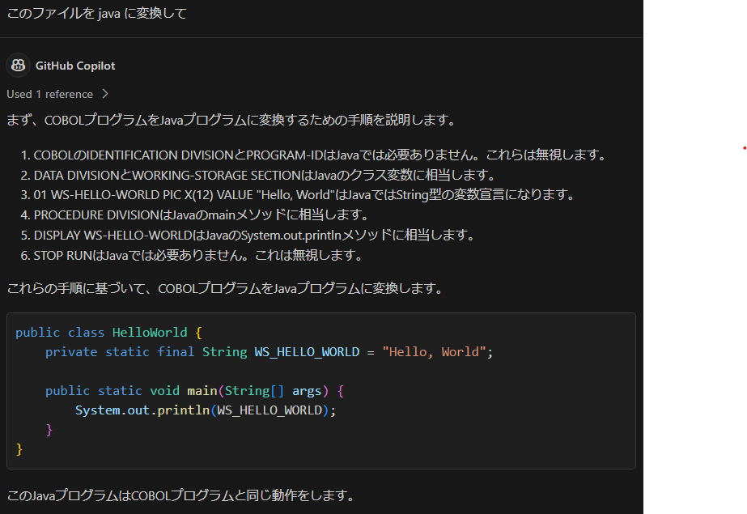

# GitHub Copilot Chat の使用例

## レガシーなコード (COBOL) をモダンなコード (Java) に書き換える

レガシーなコードで書かれたアプリケーションをモダンなコードに書き換えることは、多くの企業にとって大きな課題です。GitHub Copilot Chat は、レガシーなコードをモダンなコードに書き換える際に、開発者をサポートします。

### 利用方法

1. レガシーなコードのファイルを開く (samples/cobol/helloworld.cbl)
2. GitHub Copilot Chat に「このファイルを Java に書き換えて」とチャットする
3. GitHub Copilot Chat がモダンなコードを生成する

### レガシーなコード (COBOL) の例

```cobol
IDENTIFICATION DIVISION.
PROGRAM-ID. HELLO-WORLD.
DATA DIVISION.
WORKING-STORAGE SECTION.
01 WS-HELLO-WORLD PIC X(12) VALUE "Hello, World".
PROCEDURE DIVISION.
    DISPLAY WS-HELLO-WORLD.
    STOP RUN.
```

### モダンなコード (Java) に書き換え例

```java
public class HelloWorld {
    private static final String WS_HELLO_WORLD = "Hello, World";

    public static void main(String[] args) {
        System.out.println(WS_HELLO_WORLD);
    }
}
```

### 実行結果イメージ


